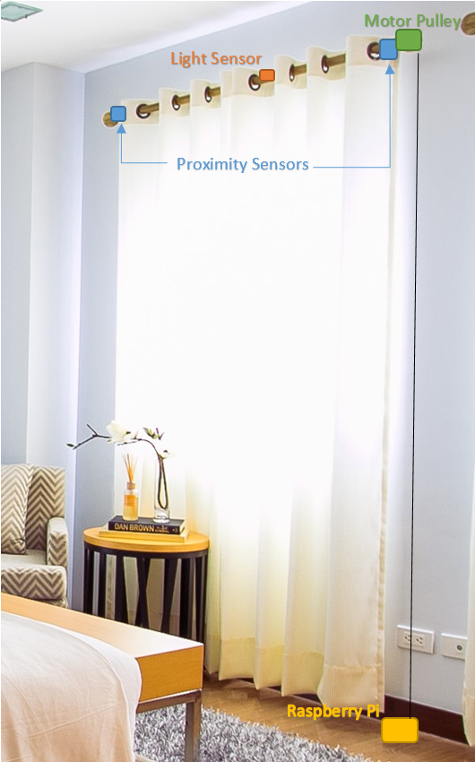

# Automatic Curtain Opener

The automatic curtain opener allows curtain to be opened and closed: 
* Remotely 
* At specific times 
* Automatically at dawn and dusk 

Thus allowing users to:
* Wake up naturally using the light of the sun 
* Appear at home, when away travelling

This real-time project utilises a Raspberry Pi 3, light and proximity sensors, a motorised pulley system, custom PCB boards, and a web GUI. 

More details about the hardware and software can be found in the [Wiki](https://github.com/LaurenJA/automatic-curtain/wiki.

### System Overview 

Below is an simple overview of how the deployed sensors and motor could be positioned on the curtain pole. 



### Build Instructions 

The code related to this project can be found in the code folder.

#### Requirements 
CMake version 3.10 

Python version 3.6

Django version 2.11.1

#### Build 
Compile the project 
``` 
make
```

To run the program
``` 
sudo ./server 
```

To open the folder of the web app(which is named as mysite in this project).
```
cd ...
```

Then run the server.
```
python3 manage.py runserver
```

### Project Evaluation

#### Sampling rate
Under the Auto model, the status will be checked every 0.2 seconds, so the sampling rate should be 5 times per seconds.
#### Bus Protocol
The interface of the light sensor:OPT3001 and proximity sensor:APDS9960 are I2C, so use the I2C bus protocol.
#### Low level implementation: kernel or user space and why?
User space. As this can provided fast enough sampling and processing, without having to modeify the kernel. 
#### Data flow from hardware to GUI to output with data formats, latencies,processing and conversions.
Not provided
#### Buffering of data: how many samples?
The buffering of data is 8k, which is enough for this project.
#### How does the buffering impact on the realtime performance and how much latency is introduced?
For the large amount of data, the buffering of data should be higher, however,for our project, the ultra-small amout of date has no influence on realtime performance.
#### How many threads are needed and/or how can the load be distributed to allow a responsive application?
There are two threads, one is for communication with GUI, and one if to achieve function of the command.
#### Structure of the software in classes, associated unit tests to turn it into reliable software
The required software is provided within the code folder. This can be compiled and executed on the Raspberry pi by using the following command: make ./server within the code directory. And the test code also can be found in the test folder.
Overview of the software can be found in the wiki
#### Team structure: which roles in a team of 3 and how equal contributions are guaranteed?
The team members and roles are as follow:
Lauren Astell: Hardware (including PCB Design)
Jing Wang: Code of light sensor,proximity sensor,motor controller and main function implementaion and test.
Jianan Kan:GUI Implementation
#### How much time is allocated to hard, software and debugging and how is this interleaved?
Every memeber will do their specific work, and control the process by themselves. The final work achieved by Lauren.
#### Which version control software is used? How are releases / milestones done and numbered?

#### What is the release strategy / publication / publicity? How is that measured and deemed to be successful?

####  Measurement of success of the application in the context of the problem given and evaluation of it.

#### How to implement the GUI? Permitted refresh rate and latency resulted from it.
To use the web page as the GUI, the web page is coded in django. Everyone who get the website can control the curtain in the same network. The instruction can be sent by GUI.
